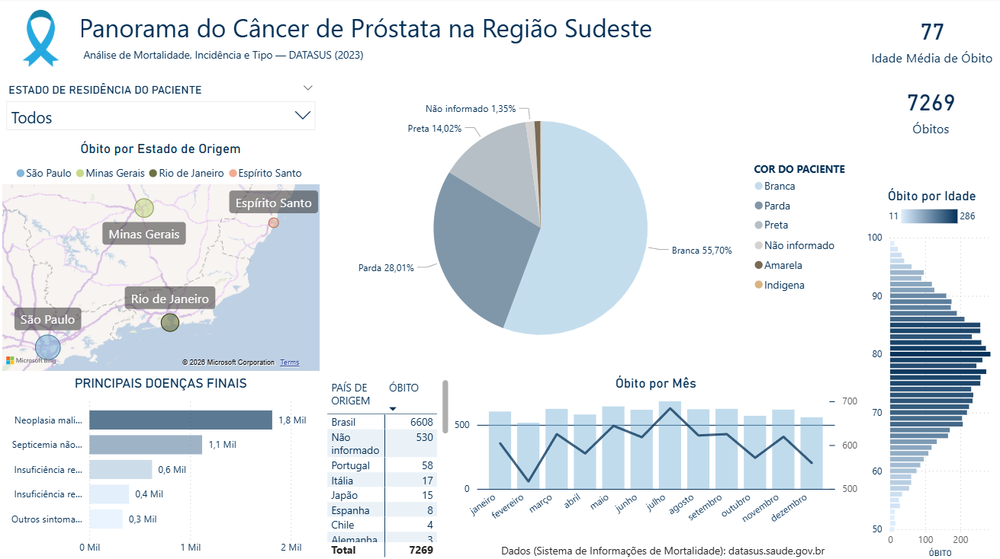

# Análise do Câncer de Próstata no Sudeste Brasileiro 2023 — DATASUS
Análise exploratória de óbitos por Câncer de Próstata (CID-10 C61) no Sudeste brasileiro em 2023, utilizando dados públicos do DATASUS.

Este projeto tem como objetivo realizar uma análise exploratória de óbitos por câncer de neoplasia maligna da próstata no Sudeste brasileiro em 2023, foram utilizadas ferramentas sendo Python e SQL para pré-processamento, e ferramentas de visualização para processamento e apresentação dos dados sendo Power Query e Power BI.

## 🎯 Objetivos

- Analisar o número de óbitos por câncer de próstata
- Comparar os resultados entre os estados do Sudeste
- Analisar a distribuição etária dos óbitos
- Calcular indicadores epidemiológicos
- Desenvolver visualizações para facilitar a interpretação dos dados

---

## 📊 Fontes dos dados

- [DATASUS — Ministério da Saúde](https://datasus.saude.gov.br/)
- [Transferência de Arquivos DATASUS](https://datasus.saude.gov.br/transferencia-de-arquivos/)
- [microdatasus](https://github.com/rfsaldanha/microdatasus/)
- [CID-10](http://www2.datasus.gov.br/cid10/V2008/descrcsv.htm/)

Os dados são públicos e foram utilizados exclusivamente para fins educacionais e de análise.

## 🛠️ Tecnologias utilizadas
- Python
- pandas
- SQL
- Power Query
- Power BI

## Resultados

Dashboard Final

